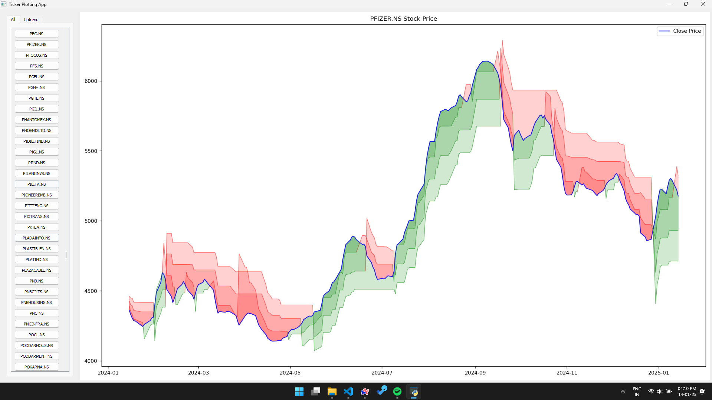

# Supertrend-Indicator-Charting-Tool
A charting tool that plots 3 SuperTrend indicators of different lengths and multipliers on stocks listed in the NSE to indicate predictive price action. These 3 trend-following indicators filter stocks with potential uptrend and display their charts.

